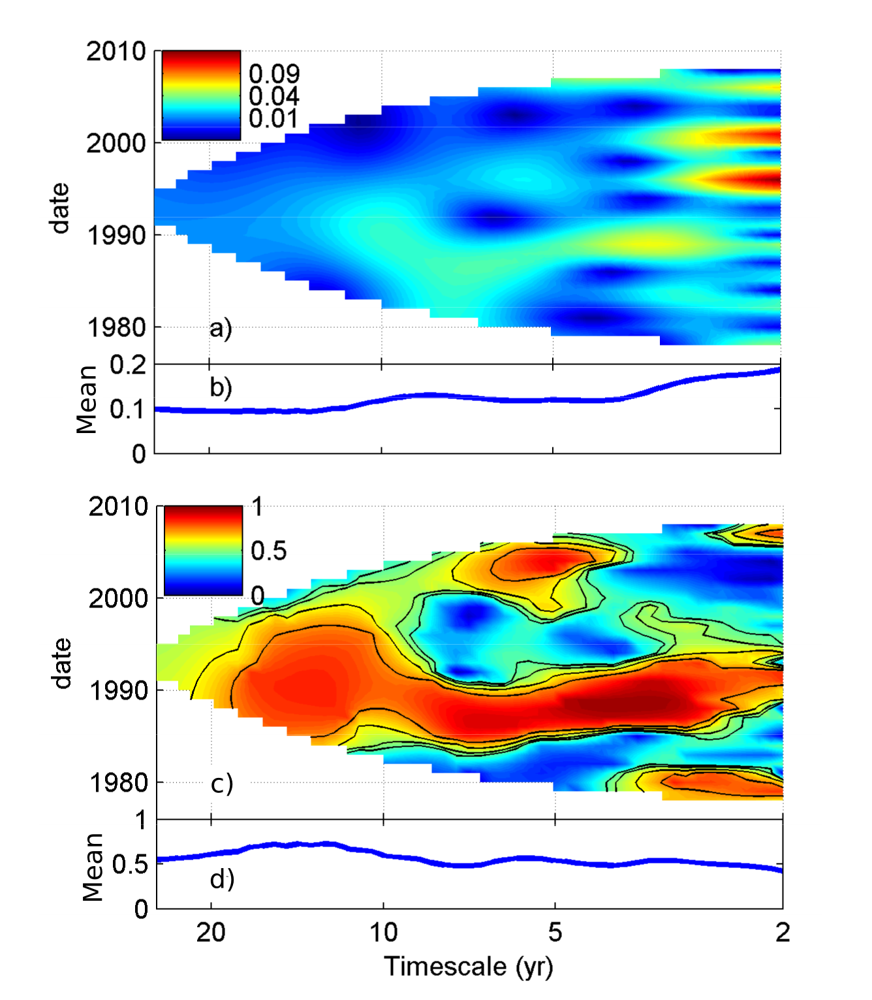
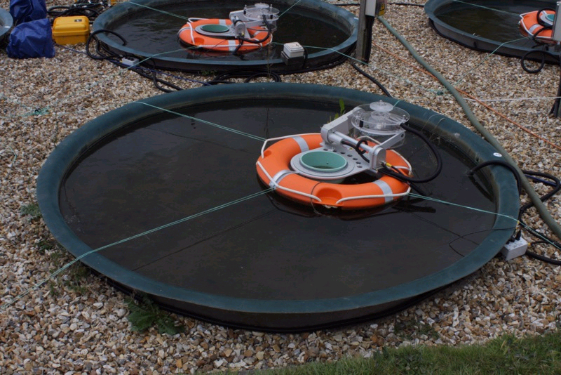

::: {.column-screen .hero-section}
::: {.column-body}
# Reuman Lab

::: {.hero-tagline}
We use math, statistics, and computation to understand the dynamics of natural populations and improve how people share a changing planet with the rest of life.
:::

::: {.hero-followup}
Including theory, merging theory with data, applicable work, and applied work.
:::
:::
:::

## Current research {.current-research-heading}

::: {.grid}

::: {.g-col-12 .g-col-md-6}
::: {.vignette-card}
::: {.vignette-img}
climate variability & species distributions
:::
::: {.vignette-body}
#### How does climate variability shape where species live?

Species distribution models almost always treat climate as an average. But for many species, year-to-year variability — heat waves, droughts, the timing of frosts — matters as much as the mean. Our new modelling framework shows that variability can shrink species' ranges substantially, and that future ranges may be just as sensitive to changes in variability as to changes in average climate.

[Read more →](research.qmd#climate-variability){.vignette-readmore}
:::
:::
:::

::: {.g-col-12 .g-col-md-6}
::: {.vignette-card}
::: {.vignette-img .vignette-img-photo}

:::
::: {.vignette-body}
#### Why do populations rise and fall in sync across continents?

Populations of the same species  often fluctuate together across hundreds or thousands of kilometers. Over a decade of work in the lab has dissected this synchrony along three statistical dimensions — across timescales, across geography, and in its asymmetries — and used each to uncover both its causes and its consequences for biodiversity and ecosystem function. We have worked across numerous systems/taxa including kelp forests, marine and freshwater plankton, grasslands, exploited fish species, and crop pests. 

[Read more →](research.qmd#synchrony){.vignette-readmore}
:::
:::
:::

::: {.g-col-12 .g-col-md-6}
::: {.vignette-card}
::: {.vignette-img}
agricultural yield forecasting
:::
::: {.vignette-body}
#### Can we forecast crop yields prior to harvest?

Modern farm machinery collects huge amounts of fine-grained yield data, but most farmers can't use it without specialized expertise. We are building machine-learning models that turn that data into actionable mid-season yield forecasts at 20-meter resolution. Prototype models already explain more than 70% of out-of-sample yield variation, and we are gearing up to deliver operational corn-yield forecasts to partner farms ahead of the 2026 harvest.

[Read more →](research.qmd#agricultural-ml){.vignette-readmore}
:::
:::
:::

::: {.g-col-12 .g-col-md-6}
::: {.vignette-card}
::: {.vignette-img .vignette-img-photo}

:::
::: {.vignette-body}
#### Why does biodiversity stabilize ecosystems?

Diverse ecosystems tend to be more stable than species-poor ones. Working with collaborators, we study the mechanisms of this relationship and the effects of climate change on them.

[Read more →](research.qmd#stability){.vignette-readmore}
:::
:::
:::

:::

::: {.column-screen .software-strip-outer}
::: {.column-body}

### Open-source tools from the lab {.software-strip-title}

::: {.software-pills}
[**`xsdm`** — species distribution models that account for climate variability](software.qmd#xsdm){.software-pill}
[**`wsyn`** — wavelet methods for spatial synchrony](software.qmd#wsyn){.software-pill}
[**`tsvr`** — timescale-specific variance ratios for community stability](software.qmd#tsvr){.software-pill}
[**`cheddar`** — analysis and visualization of food-web data](software.qmd#cheddar){.software-pill}
:::

[All software →](software.qmd){.all-software-link}

:::
:::

::: {.pi-strip}
**Daniel Reuman** is Professor in the Department of Ecology & Evolutionary Biology and Senior Scientist in the Kansas Biological Survey at the University of Kansas.
:::
